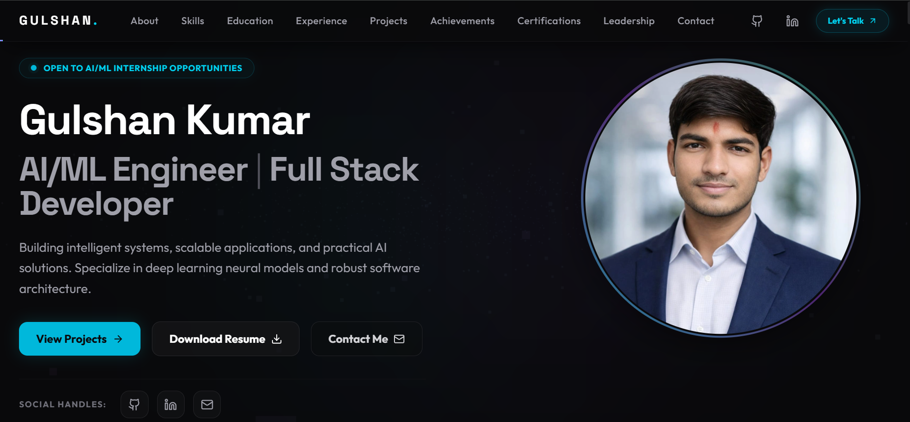

<div align="center">



# Gulshan Kumar

### AI/ML Engineer • Software Engineer • Full Stack Developer

Building intelligent systems, scalable software, and production-ready applications.

<p>

<a href="https://gulshanverse.vercel.app">

</a>

<a href="https://github.com/gulshanverse">

</a>

<a href="https://linkedin.com/in/gulshanverse">

</a>

</p>

</div>

---

# About

This repository contains the complete source code for my personal portfolio website.

The portfolio represents my journey as a software engineer and AI/ML developer, showcasing projects, technical expertise, achievements, certifications, and practical experience through a modern, interactive interface.

Designed with performance, responsiveness, accessibility, and clean architecture in mind, the website serves as both my digital portfolio and a demonstration of my development approach.

---

# Features

- Modern premium UI
- Fully responsive layout
- Interactive animations using Framer Motion
- AI/ML focused branding
- Project showcase
- Technical skills section
- Experience timeline
- Certifications
- Achievements
- Contact form
- Optimized Next.js architecture
- SEO friendly
- Fast loading performance

---

# Tech Stack

| Category | Technologies |
|----------|--------------|
| Framework | Next.js 15 |
| Language | TypeScript |
| UI | React 19 |
| Styling | Tailwind CSS |
| Animation | Framer Motion |
| Icons | Lucide React |
| Deployment | Vercel |

---

# Folder Structure

```text
portfolio-website
│
├── public/
├── src/
│   ├── app/
│   ├── components/
│   │
│   ├── sections/
│   │     ├── Hero
│   │     ├── About
│   │     ├── Skills
│   │     ├── Experience
│   │     ├── Projects
│   │     ├── Achievements
│   │     ├── Certifications
│   │     └── Contact
│   │
│   └── ...
│
├── package.json
└── README.md
```

---

# Local Development

Clone the repository

```bash
git clone https://github.com/gulshanverse/portfolio-website.git
```

Move inside the project

```bash
cd portfolio-website
```

Install dependencies

```bash
npm install
```

Start development server

```bash
npm run dev
```

Open

```
http://localhost:3000
```

---

# Current Sections

- Hero
- About
- Skills
- Experience
- Projects
- Achievements
- Certifications
- Contact

---

# Upcoming Enhancements

This portfolio is actively evolving.

Planned additions include:

- AI Portfolio Assistant
- Interactive 3D Hero Section
- Dynamic GitHub Statistics
- Blog & Technical Articles
- Case Study Pages
- Dark / Light Theme
- Resume Analytics
- Better Project Demonstrations
- Advanced Motion Effects
- Performance Improvements

---

# Performance Goals

- Responsive on all devices
- Clean UI/UX
- Lighthouse optimized
- Production ready
- Maintainable architecture
- Scalable component design

---

# Live Website

### 🌐 https://gulshanverse.vercel.app

---

# Connect

- Portfolio → https://gulshanverse.vercel.app
- GitHub → https://github.com/gulshanverse
- LinkedIn → https://linkedin.com/in/YOUR-LINKEDIN
- Email → gulshankumaritggv@gmail.com

---

<div align="center">

### Thanks for visiting!

If you like this project, consider giving it a ⭐

Built with ❤️ by **Gulshan Kumar**

</div>
